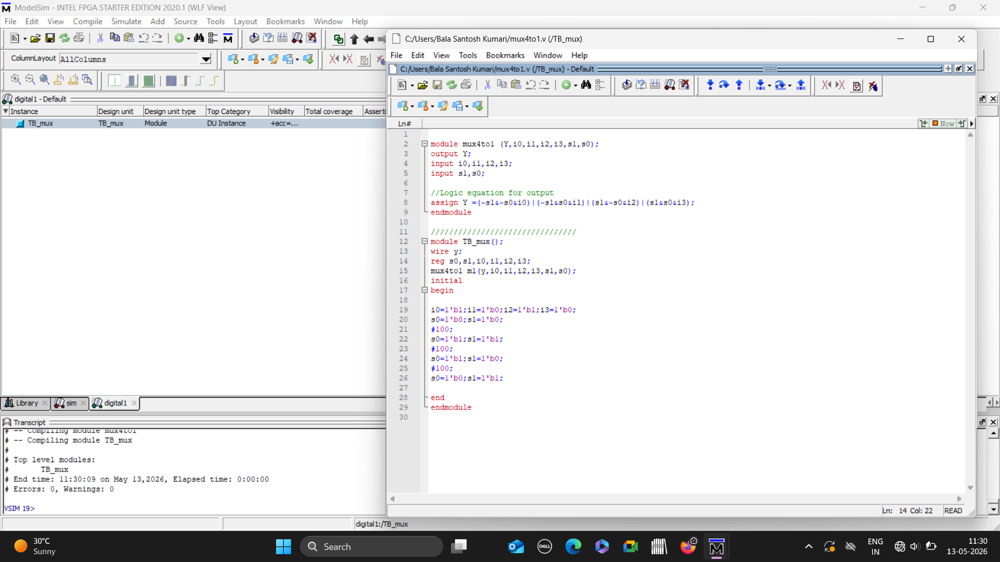
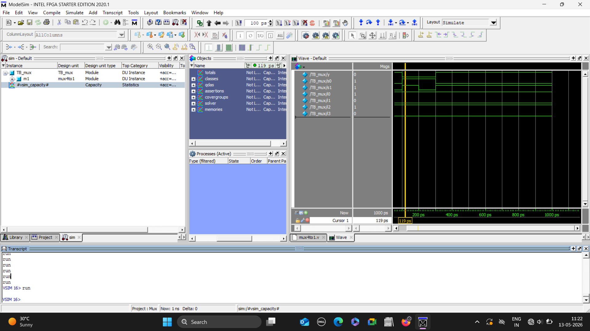

# 4:1 MUX using Verilog

## Objective
Implemented and stimulated a 4:1 Multiplexer using Verilog in Modelsim.

## Concepts used
- Combinational logic
- Multiplexer operation 
- Verilog HDL basics 

  

## Verilog code 

## Simulation Waveform

## Results
Verified correct output selection based on select line combinations.

## Tools used

- Verilog HDL
- Modelsim
